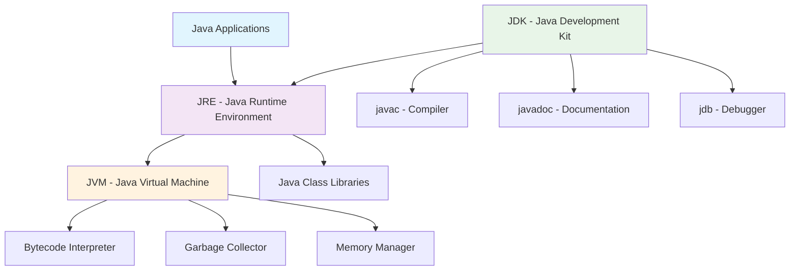
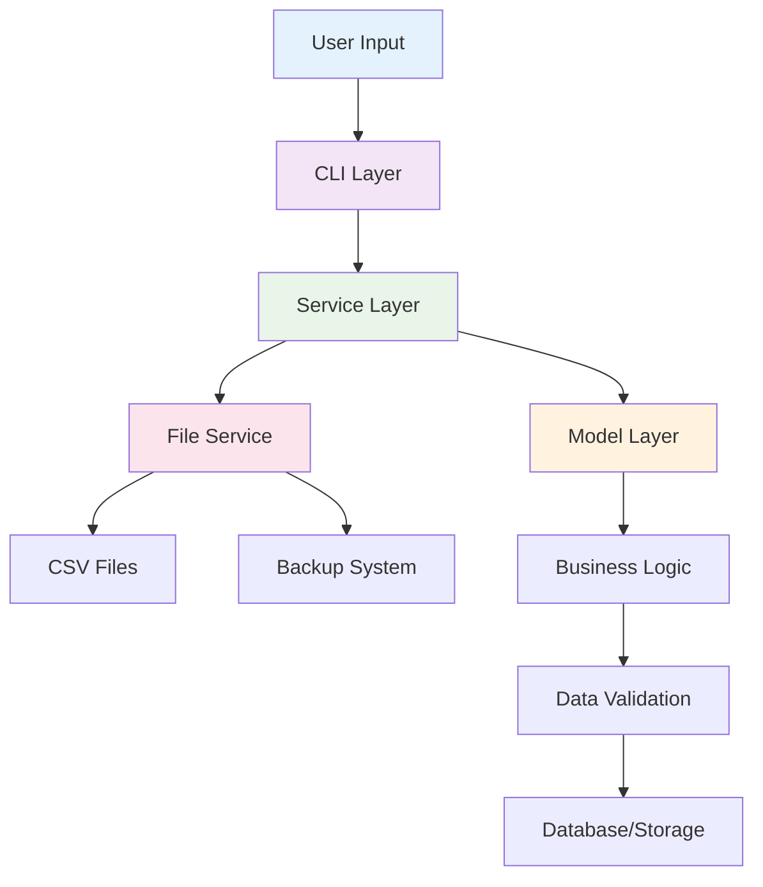

# 🎓 Campus Course & Records Manager (CCRM)

<div align="center">


*A comprehensive academic management system built with modern Java technologies*

[🚀 Quick Start](#-quick-start) • [📋 Features](#-features) • [🏗️ Architecture](#️-architecture) • [📖 Documentation](#-documentation) • [🤝 Contributing](#-contributing)

</div>

---

## 📖 Overview

**CCRM** is a sophisticated console-based academic management system designed for educational institutions. Built entirely in Java SE, it provides a complete solution for managing student records, course catalogs, enrollment processes, and academic reporting.

### 🎯 What Makes CCRM Special?

- **🏛️ Real-world Application**: Designed for actual academic institutions
- **⚡ Modern Java**: Leverages Java 17+ features and best practices
- **🔧 Production Ready**: Comprehensive error handling and data validation
- **📊 Rich Reporting**: Advanced analytics and transcript generation
- **💾 Data Persistence**: CSV import/export with automated backup systems
- **🎨 Clean Architecture**: Well-structured, maintainable codebase

### 🛠️ Technology Stack

| Component | Technology | Version |
|-----------|------------|---------|
| **Language** | Java | 17+ |
| **Build Tool** | javac | Native |
| **File I/O** | NIO.2 | Modern |
| **Data Format** | CSV | Standard |
| **Architecture** | Layered | Service-Oriented |

## ☕ Java Platform Deep Dive

### 📈 Java Evolution Timeline

<details>
<summary><b>Click to expand the complete Java evolution timeline</b></summary>

| Year | Version | Key Features | Impact |
|------|---------|--------------|--------|
| **1995** | Java 1.0 | Applets, AWT | Web revolution begins |
| **1997** | Java 1.1 | Inner classes, Reflection, JDBC | Enterprise features |
| **1998** | Java 1.2 | Collections, Swing, JIT | "Write once, run anywhere" |
| **2000** | Java 1.3 | HotSpot JVM, JNDI | Performance breakthrough |
| **2002** | Java 1.4 | Assertions, NIO, Regex | Developer productivity |
| **2004** | Java 5.0 | Generics, Enums, Annotations | Type safety revolution |
| **2006** | Java 6 | Scripting, JDBC 4.0 | Enterprise maturity |
| **2011** | Java 7 | Try-with-resources, Diamond | Resource management |
| **2014** | Java 8 | Lambdas, Streams, Optional | Functional programming |
| **2017** | Java 9 | Modules, JShell | Modular architecture |
| **2018** | Java 11 | LTS, HTTP Client | Long-term support |
| **2021** | Java 17 | LTS, Sealed classes | Modern Java foundation |
| **2023** | Java 21 | LTS, Virtual threads | Concurrency revolution |

</details>

### 🏗️ Java Platform Architecture

<div align="center">



</div>

#### 📱 Java Platform Editions Comparison

| Edition | Target | Memory | Use Cases | CCRM Usage |
|---------|--------|--------|-----------|------------|
| **Java ME** | Embedded/Mobile | < 64MB | IoT, Feature phones | ❌ Not used |
| **Java SE** | Desktop/Server | 64MB+ | Desktop apps, CLI tools | ✅ **Primary** |
| **Java EE** | Enterprise | 256MB+ | Web apps, Microservices | ❌ Not used |

#### 🔧 JDK vs JRE vs JVM Explained

<details>
<summary><b>Understanding the Java ecosystem components</b></summary>

**🎯 JVM (Java Virtual Machine)**
- **Role**: The execution engine that runs Java bytecode
- **Responsibilities**: 
  - Memory management and garbage collection
  - Bytecode interpretation and JIT compilation
  - Platform-specific optimizations
- **Platform**: Windows, Linux, macOS (different JVM for each)

**📦 JRE (Java Runtime Environment)**
- **Components**: JVM + Java Class Libraries + Supporting files
- **Purpose**: Execute Java applications (not develop them)
- **Contains**: Everything needed to run Java programs

**🛠️ JDK (Java Development Kit)**
- **Components**: JRE + Development tools
- **Tools Included**:
  - `javac` - Java compiler
  - `java` - Runtime launcher
  - `javadoc` - Documentation generator
  - `jdb` - Debugger
  - `jps` - Process status tool
- **Purpose**: Develop and compile Java applications

</details>

## 🚀 Quick Start

### 📋 Prerequisites

Before you begin, ensure you have the following installed:

- **☕ Java Development Kit (JDK) 17 or higher**
  - Download from [Oracle](https://www.oracle.com/java/technologies/downloads/) or [OpenJDK](https://openjdk.org/)
  - Verify installation: `java -version`
- **💻 Operating System**: Windows 10+, macOS 10.14+, or Linux (Ubuntu 18.04+)
- **📁 Terminal/Command Prompt**: For running commands

### ⚡ Getting Started in 3 Steps

#### Step 1: Clone and Navigate
```bash
git clone <repository-url>
cd CCRM
```

#### Step 2: Compile the Application

<details>
<summary><b>🪟 Windows (PowerShell/CMD)</b></summary>

```powershell
# Navigate to project directory
cd C:\path\to\CCRM

# Compile all Java files
javac -d out -cp src src/edu/ccrm/config/AppConfig.java src/edu/ccrm/cli/CCRM.java src/edu/ccrm/model/*.java src/edu/ccrm/model/enums/*.java src/edu/ccrm/model/interfaces/*.java src/edu/ccrm/model/value/*.java src/edu/ccrm/exceptions/*.java src/edu/ccrm/service/*.java

# Run the application
java -ea -cp out edu.ccrm.cli.CCRM
```

</details>

<details>
<summary><b>🐧 Linux/macOS (Terminal)</b></summary>

```bash
# Navigate to project directory
cd /path/to/CCRM

# Compile all Java files
find src -name "*.java" | xargs javac -d out

# Run the application
java -ea -cp out edu.ccrm.cli.CCRM
```

</details>

#### Step 3: Start Managing! 🎉

Once the application starts, you'll see the main menu. Try these first steps:

1. **📊 Import Sample Data**: Go to "Import/Export Data" → Import students/courses
2. **👥 Add a Student**: Go to "Manage Students" → Add Student
3. **📚 Create a Course**: Go to "Manage Courses" → Add Course
4. **🎓 Enroll Students**: Go to "Enrollment" → Enroll Student

### 🔧 Configuration Options

#### Enabling Assertions
Assertions help catch bugs during development but are disabled by default for performance:

```bash
# Enable all assertions
java -ea -cp out edu.ccrm.cli.CCRM

# Enable assertions only for CCRM package
java -ea:edu.ccrm -cp out edu.ccrm.cli.CCRM

# Disable assertions (default behavior)
java -da -cp out edu.ccrm.cli.CCRM
```

#### Memory Configuration
For large datasets, you might need to increase heap size:

```bash
# Allocate 2GB of heap memory
java -Xmx2g -ea -cp out edu.ccrm.cli.CCRM
```

## 🏗️ Project Architecture

### 📁 Directory Structure

```
CCRM/
├── 📂 src/                              # Source code directory
│   └── 📂 edu/ccrm/                     # Main package namespace
│       ├── 🎮 cli/                      # Command Line Interface
│       │   └── 📄 CCRM.java             # Main application entry point
│       ├── ⚙️ config/                   # Configuration management
│       │   └── 📄 AppConfig.java        # Singleton configuration class
│       ├── ⚠️ exceptions/               # Custom exception classes
│       │   ├── 📄 DuplicateEnrollmentException.java
│       │   └── 📄 MaxCreditLimitExceededException.java
│       ├── 🏛️ model/                    # Domain models and entities
│       │   ├── 📄 Person.java           # Abstract base class
│       │   ├── 📄 Student.java          # Student entity with nested classes
│       │   ├── 📄 Instructor.java       # Instructor entity
│       │   ├── 📄 Course.java           # Course entity with Builder pattern
│       │   ├── 📄 Enrollment.java       # Enrollment entity
│       │   ├── 📄 Transcript.java       # Transcript with inner classes
│       │   ├── 📂 enums/                # Enumeration types
│       │   │   ├── 📄 Semester.java     # Academic semester enum
│       │   │   └── 📄 Grade.java        # Grade enum with point values
│       │   ├── 📂 interfaces/           # Interface definitions
│       │   │   ├── 📄 Persistable.java  # CSV persistence interface
│       │   │   └── 📄 Searchable.java   # Generic search interface
│       │   └── 📂 value/                # Value objects
│       │       └── 📄 CourseCode.java   # Immutable course code class
│       └── 🔧 service/                  # Business logic services
│           ├── 📄 StudentService.java   # Student management operations
│           ├── 📄 CourseService.java    # Course management operations
│           ├── 📄 EnrollmentService.java # Enrollment and grading logic
│           ├── 📄 TranscriptService.java # Transcript generation
│           └── 📄 FileService.java      # File I/O and backup operations
├── 📂 test-data/                        # Sample data for testing
│   ├── 📄 students.csv                  # Sample student records
│   ├── 📄 courses.csv                   # Sample course catalog
│   └── 📄 instructors.csv               # Sample instructor data
├── 📂 data/                             # Runtime data storage
├── 📂 out/                              # Compiled bytecode
├── 📂 screenshots/                      # Application screenshots
├── 📄 README.md                         # Project documentation
└── 📄 USAGE.md                          # Detailed usage guide
```

### 🎯 Design Patterns Used

| Pattern | Location | Purpose | Benefits |
|---------|----------|---------|----------|
| **Singleton** | `AppConfig` | Configuration management | Single source of truth |
| **Builder** | `Course.Builder` | Complex object creation | Fluent API, validation |
| **Service Layer** | All `*Service` classes | Business logic separation | Maintainability, testability |
| **Value Object** | `CourseCode` | Immutable data | Thread safety, consistency |
| **Strategy** | `Searchable<T>` | Flexible search algorithms | Extensibility, polymorphism |

### 🔄 Data Flow Architecture

<div align="center">



</div>

## ✨ Features & Capabilities

### 🏛️ Domain Models & Object-Oriented Design

Our domain model is built on solid OOP principles, making the codebase maintainable and extensible:

- **🎭 Abstract Base Class**: `Person` serves as the foundation for all human entities
- **👥 Concrete Entities**: `Student`, `Instructor`, `Course`, `Enrollment`, `Transcript`
- **📊 Rich Enumerations**: `Semester` and `Grade` with business logic and grade point calculations
- **🔒 Immutable Value Objects**: `CourseCode` ensures data integrity and thread safety
- **🔌 Flexible Interfaces**: `Persistable` and `Searchable<T>` for cross-cutting concerns
- **🏗️ Nested Classes**: `Student.Statistics` (static) and `Transcript.TranscriptEntry` (inner)
- **🎯 OOP Pillars**: Complete demonstration of inheritance, encapsulation, abstraction, and polymorphism

### 👨‍🎓 Student Management System

A comprehensive student lifecycle management system:

- **➕ Student Registration**: Add new students with validation
- **📋 Student Directory**: List, search, and filter students by multiple criteria
- **✏️ Profile Management**: Update student information and academic records
- **📊 Academic Profiles**: View detailed student profiles with enrollment history
- **📅 Modern Date Handling**: Uses Java 8+ Date/Time API for timestamps
- **🔍 Advanced Search**: Find students by name, email, registration number, or course enrollment

### 📚 Course Catalog Management

Powerful course management with modern Java features:

- **🏗️ Builder Pattern**: Fluent API for creating complex course objects
- **👨‍🏫 Instructor Assignment**: Assign and manage course instructors
- **🔍 Stream-Powered Search**: Filter courses by instructor, department, semester using Java Streams
- **📊 Sorting & Organization**: Sort courses by code, title, or credits using Arrays utilities
- **📝 Course Lifecycle**: Create, update, activate, and deactivate courses
- **🏷️ Department Organization**: Organize courses by academic departments

### 🎓 Enrollment & Academic Records

Sophisticated enrollment system with business rule enforcement:

- **📝 Smart Enrollment**: Enroll students with automatic credit limit validation (18 credits max)
- **🎯 Business Rules**: Prevents duplicate enrollments and credit overload
- **📊 Grade Management**: Record grades by percentage or letter grade
- **🧮 GPA Calculation**: Automatic GPA computation with weighted averages
- **📜 Transcript Generation**: Beautiful transcript formatting with polymorphism
- **⚠️ Custom Exceptions**: `DuplicateEnrollmentException` and `MaxCreditLimitExceededException`

### 💾 Data Persistence & Backup

Enterprise-grade data management:

- **📥 CSV Import/Export**: Seamless data exchange with external systems
- **🔄 Automated Backups**: Timestamped backup creation using NIO.2
- **📊 Recursive Utilities**: Calculate backup directory sizes recursively
- **🛡️ Data Validation**: Comprehensive input validation and error handling
- **📁 File Management**: Modern file operations using Java NIO.2

### 🎮 Command Line Interface

Intuitive and feature-rich console interface:

- **🔄 All Loop Constructs**: Demonstrates while, do-while, for, enhanced-for loops
- **🎯 Control Flow**: Break, continue, and labeled jumps for complex navigation
- **⚡ Decision Making**: Comprehensive if/else and switch statement usage
- **🛡️ Error Handling**: Robust exception handling throughout the application
- **📱 User Experience**: Clear menus and helpful error messages

### 🚀 Advanced Java Features

Cutting-edge Java programming techniques:

- **🌊 Stream API**: Functional programming for data processing and reporting
- **🔧 Lambda Expressions**: Concise code for comparators and predicates
- **🎭 Anonymous Classes**: Custom implementations for sorting and callbacks
- **🔄 Type Casting**: Upcast/downcast with instanceof checks
- **✅ Assertions**: Invariant checking for debugging and validation
- **📊 Functional Interfaces**: Predicate, Comparator, and custom functional interfaces

### ⚠️ Exception Handling & Validation

Production-ready error management:

- **🎯 Custom Exceptions**: Domain-specific exception classes
- **🔄 Multi-catch**: Handle multiple exception types efficiently
- **🛡️ Try-with-resources**: Automatic resource management
- **📤 Exception Propagation**: Proper exception handling hierarchy
- **✅ Input Validation**: Comprehensive data validation at all levels

## Syllabus Topic Mapping

| Syllabus Topic | File/Class/Method | Description |
|----------------|-------------------|-------------|
| **OOP Concepts** | | |
| Inheritance | `Person` → `Student`, `Instructor` | Abstract base class with concrete implementations |
| Encapsulation | All model classes | Private fields with public getters/setters |
| Abstraction | `Person.getPersonType()`, `Person.getDisplayInfo()` | Abstract methods in base class |
| Polymorphism | `toString()` overrides, method overriding | Runtime polymorphism through method overriding |
| **Design Patterns** | | |
| Singleton | `AppConfig` | Eager initialization singleton pattern |
| Builder | `Course.Builder` | Builder pattern for complex object creation |
| **Advanced Java** | | |
| Enums | `Semester`, `Grade` | Enumerations with methods and values |
| Interfaces | `Persistable`, `Searchable<T>` | Interface implementation and generics |
| Nested Classes | `Student.Statistics`, `Transcript.TranscriptEntry` | Static and inner nested classes |
| Generics | `Searchable<T>` | Generic interface with type parameters |
| **Collections & Streams** | | |
| Stream API | `StudentService.searchByName()` | Stream operations for filtering and mapping |
| Lambda Expressions | `CourseService.getCoursesSortedByCode()` | Lambda expressions in sorting |
| Functional Interfaces | `Predicate<T>` usage | Built-in functional interfaces |
| **Exception Handling** | | |
| Custom Exceptions | `DuplicateEnrollmentException`, `MaxCreditLimitExceededException` | Custom exception classes |
| Try-Catch-Finally | All service methods | Comprehensive exception handling |
| **File I/O** | | |
| NIO.2 | `FileService` | Modern file operations using NIO.2 |
| CSV Processing | `importStudentsFromCSV()`, `exportStudentsToCSV()` | CSV file import/export |
| **Date/Time API** | | |
| LocalDateTime | `Person.createdAt`, `Enrollment.enrolledAt` | Modern date/time handling |
| **Recursion** | | |
| Recursive Methods | `FileService.calculateDirectorySize()` | Recursive directory size calculation |
| **Assertions** | | |
| Assert Statements | `CCRM.main()` | Assertion usage for invariants |

## Usage Instructions

1. **Compile the application** using the commands above
2. **Run the application** with assertions enabled
3. **Navigate through menus** using the provided options
4. **Import sample data** from the test-data directory
5. **Explore all features** including enrollment, grading, and reporting

## Screenshots Directory
Place the following screenshots in the `screenshots/` directory:
- `jdk_installation.png` - JDK installation verification
- `eclipse_setup.png` - Eclipse IDE setup
- `program_running.png` - Application running in console
- `exports_backups.png` - File export and backup operations

## License
MIT License - See LICENSE file for details


